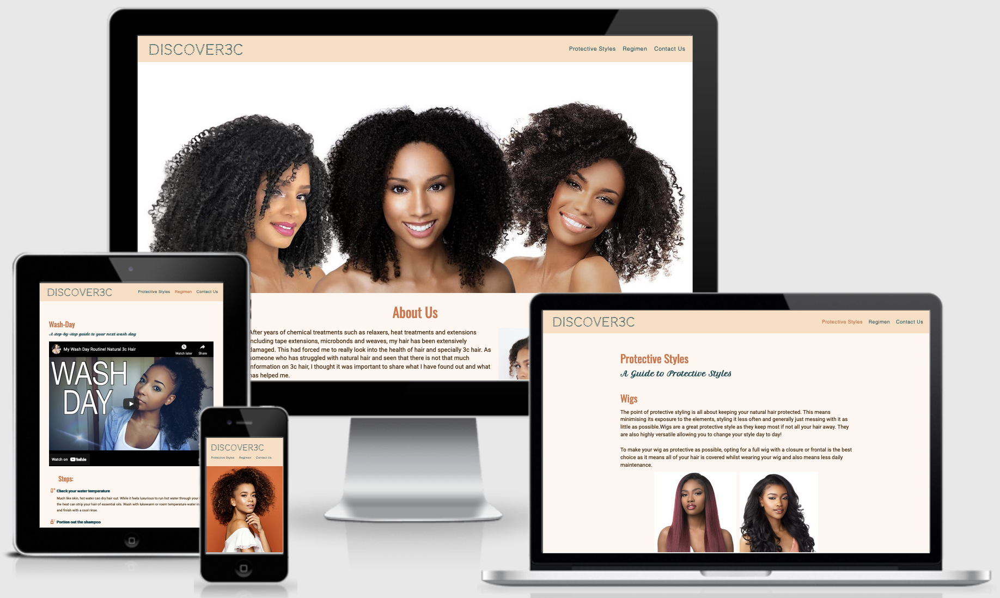
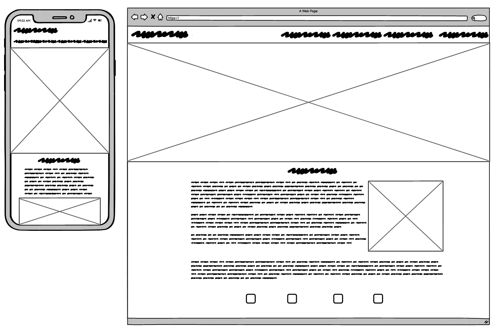
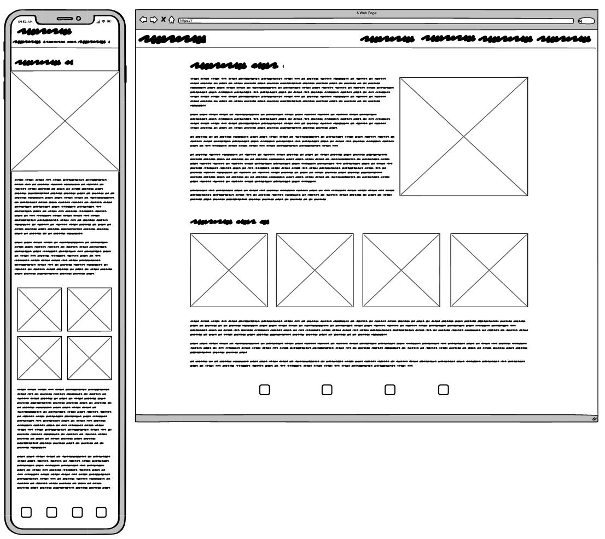
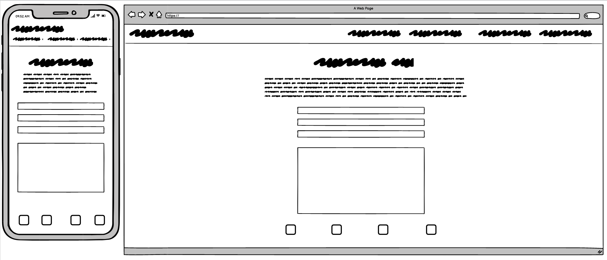

# Discover3c



[View the live project here](https://emmacharleswilson.github.io/Discover3c/)

## Table of contents
1. [Introduction](#Introduction)
2. [UX](#UX)
    1. [Ideal User Demographic](#Ideal-User-Demographic)
    2. [User Stories](#User-Stories)
    3. [Development Planes](#Development-Planes)
    4. [Design](#Design)
3. [Features](#Features)
    1. [Design Features](#Design-Features) 
    2. [Existing Features](#Existing-Features)
    3. [Features to Implement in the future](#Features-to-Implement-in-the-future)
4. [Issues and Bugs](#Issues-and-Bugs)
5. [Technologies Used](#Technologies-Used)
     1. [Main Languages Used](#Main-Languages-Used)
     2. [Frameworks, Libraries & Programs Used](#Frameworks,-Libraries-&-Programs-Used)
6. [Testing](#Testing)
     1. [Testing.md](TESTING.md)
7. [Deployment](#Deployment)
     1. [Deploying on GitHub Pages](#Deploying-on-GitHub-Pages)
     2. [Forking the Repository](#Forking-the-Repository)
     3. [Creating a Clone](#Creating-a-Clone)
8. [Credits](#Credits)
     1. [Content](#Content)
     2. [Media](#Media)
     3. [Code](#Code)
9. [Acknowledgements](#Acknowledgements)
***

## Introduction

This website was designed to help people better understand and manage 3c hair. This is a categorisation of relatively tightly curled hair that can appear in all races but in the UK is more predominant in those with BME backgrounds.

Due to the relatively small percentage of this hair type there is a shortage of information available which this website seeks to address.

This website could also have further commercial applications given there is a large market for hair care products and management regimes.

This is the first of four Milestone Projects that the developer must complete during their Full Stack Web Development Program at The Code Institute. 

The main requirements were to make a responsive and static website with a minimum of three pages using primarily **HTML5** and **CSS3**.

[Back to top ⇧](#Discover3c)

## UX 

### Ideal User Demographic
#### The ideal user of this website is:
- Someone with 3c hair
- Friends or parents of those with 3c hair 
- Stylists and hairdressers
- Those with a general interest in diversity and styles

### User Stories
#### Someone with 3c hair:
1. As someone with 3c hair, I want to easily navigate through the website to find the relevant content.
3. As someone with 3c hair, I want a clear guide to identify my hair type.
4. As someone with 3c hair, I want to be able to view options for my hair.
5. As someone with 3c hair, I want information that enables me to manage my hair effectively, including product suggestions. 

#### Friends or parents of those with 3c hair:
1. As a friend or parent of someone with 3c hair, I want to easily navigate through the website to find the relevant content. 
2. As a friend or parent of someone with 3c hair, I want to learn how to manage 3c hair.
3. As a friend or parent of someone with 3c hair, I want to learn what product's to use on 3c hair. 

### Development Planes

In order to create a comprehensive and informative website, the developer researched what similar websites included, asked people with 3c hair what would be helpful and looked into personal experience. 

#### Strategy
Broken into three categories, the website will focus on the following target audiences:
- **Roles:**
     - People currently transitioning to natural hair 
     - People with natural hair (specifically 3c)
     - People wanting to learn more about natural hair

- **Demographic:**
     - 14 - 60 year olds
     - Primarily BME and mixed race (not exclusively)

- **Psychographics:**
     - Personality & Attitudes:
          - Pro natural hair
          - Curious and open minded
     - Values:
          - Hair health conscious 
          - Respects and appreciates differences in ethnicity
     - Lifestyles:
          - Modern
          - Interested in style

The website needs to enable the **user** to:
- Obtain desired information
- Gain knowledge on this particular topic
- Contact website host
- Find them on their preferred social media platform)
- Provide an easily navigable website for users to find relevant information

The website needs to enable the **host** to:
- Develop an online presence 
- Reach the target demographic 
- Provide channel of communication for specific products and product providers

With these goals in mind, a strategy table was created to determine the trade-off between importance and viability with the following results:


#### Scope
A scope was defined in order to clearly identify what needed to be done in order to align features with the strategy previously defined. This was broken into two categories:
- **Content Requirements**
     - The user will be looking for:
          - Hair care information
          - Product information
          - Supporting imagery/videos
          - Contact details
          - Social Links
- **Functionality Requirements**
     - The user will be able to:
          - Easily navigate through the site in order to find the information they want
          - Be able to find links to external sites in order to:
               - Purchase products
               - Be able to watch supporting content
          - Contact the website host via their chosen channel of communication

#### Structure
The information architecture was organized in a **hierarchial tree structure** in order to ensure that users could navigate through the site with ease and efficiency, with the following results: 


#### Skeleton 
Wireframe mockups were created in a [Figma Workspace](https://www.figma.com/file/pRD2Oi1aSuYxhFacqOmUfT/Kryan-Live?node-id=0%3A1) with providing a positive user experience in mind:

Home Page:


Bio Page:


Live Page:


Press Kit Page:


### Design

#### Colour Scheme
The main colours used throughout the website are Ecru, Brown and Peach with accents of Teal and Orange. 

These chosen colours were because they are typically found in nature, and are complementary to the natural colours of skin and hair. They also provoke feelings of self-care and serenity.  

#### Typography
The pairing of the fonts [Roboto](https://fonts.google.com/specimen/Roboto "Link to Roboto Google Font") and [Oswald](https://fonts.google.com/specimen/Oswald "Link to Oswald Google Font") is used throughout the website with Sans Serif as the fallback font in case of import failure. 

For features that needed to be highlighted, such as the logo text and subheadings, the font [Codystar](https://fonts.google.com/specimen/Codystar "Link to Codystar Google Font") and [Petit Formal Script](http://fots.google.come/specimen/ "Link to Petit Formal Script Google Font") was used, with Sans Serif as the fallback.

#### Imagery
The selected imagery is modern and cohesively aesthetic, reflecting the style and feel of the website. It is also supporting of any informative text presented. 

The imagery is catching and visually represents the theme of the website.

All imagery provides alternative text to be used in the event that the element cannot be rendered.

[Back to top ⇧](#Discover3c)

## Features

### Design Features
Each page of the website features a consistent responsive navigational system:
- The **Header** contains a conventionally placed **logo** in the top left of the page (whereby by clicking this will redirect users back to the home page) and **navigation bar** in the top right of the page.
- The **Footer** contains the appropriate **social media icons**, linking users to the appropriate social media site. On smaller screens the Footer decreases in size relative to the other elements on the page.
- On smaller screens, the navigation bar shrinks in size and goes under the logo.


<dl>
  <dt><a href="index.html" target="_blank" alt="Discover3c Home Page">Home Page</a></dt>
  <dd>The Home Page consists of a hero image and and about us section:
     <ul>
          <li><strong>Hero Image</strong> - Occupying 80% of the page width, while viewing on a desktop. On mobile devices the image changes to fit the screen better, while occupying 100% of the page width. The imagery used was specifically chosen as it created a impactful first impression, setting the tone of the website for the user.
          </li>
          <li><strong>About Us text and imagegy</strong> - The text occupies 60% of the page width while textwrapping around the image. The what is 3c hair section has an image occupying 40% of the page width while the text stays at 60%. This was to make the viewing of this information clear and easy to understand. On smaller screens, the width of the text and imagery increases to take up 90% of the page width and all image size decreases retrospectively.  
          </li>
     </ul>
  </dd>

  <dt><a href="protective.html" target="_blank" alt="Protective Styles Page">Protective Styles Page</a></dt>
  <dd>The Protective Styles page was made with clear informative text and imagery in mind:
     <ul>
          <li><strong>Imagegry</strong> - Occupying around 60% of the page width while viewing on desktop, each image was cafely selected to properly portray the style that is being talked about. These images reduce in size retrospectively when the screen size is reduced.
          </li>
          <li><strong>Text</strong> - Occupying 60% of the page width while viewing on desktop, this was to keep everything nicely aligned and to the make the information clear and appealing. The width of the text increases to 90% on small screens and reduces in size. 
          </li>
     </ul>
  </dd>

  <dt><a href="regimen.html" target="_blank" alt="Regimen Page">Regimen Page</a></dt>
  <dd>The look of this page is coherient with the other pages however the layout is slightly changed to allow for specific imagery and videos. 
     <ul> 
          <li><strong>Wash Day video</strong> - Occupying around 60% width of the page while viewing on desktop, this highers the video's importance by making it a large aspect of this page. This was an <strong>embedded link</strong> from YouTube by Milky Candles. For smaller screens the video size decreases retrospectively.  
          </li>
          <li><strong>Product Suggestion</strong> - Split into a 1 row with 4 coloumns, the product images are nicely aligned into 4 blocks while viewing on a desktop. On smaller screens this changes to 2 rows with 2 columns allowing the images to display as a block of 4. 

</ul>

  </dd>

  <dt><a href="contact.html" target="_blank" alt="Contact Us Page">Contact Us Page</a></dt>
  <dd> On the desktop, the contact us form occupies 60% width of the page. This descreases retrospectively for tablet view. On mobile device the form takes up 90% width of the page. 
  </dd>
  <dd>There is a <strong>call to action</strong> button on the page:
     <ul>
          <li>Which propts the user to fill out each section of the form, on submit the form resets.</li>
     </ul>
  </dd>
  
  </dd>
</dl>
 
### Existing Features
- **Header Logo** - Appearing on every page for brand recognition. Clicking the logo will return the users to the home page, as expected.
- **Header Navigation Bar** - Appearing on every page for a consistently easy and intuitive navigable system.
- **Social Icons** - Appearing on every page in the footer, the icons are appropriate representations of the Social Media platforms, linking to preferred social media platform. 
- **Videography** - Appearing on the Regimen page for a clearer understanding of the information being portrayed. 
- **Contact Form** - A contact form is used on the Contact us page, in order to provide a point of contact for the user. The form is not valid and on pressing submit the form will reset.

- **[Home Page](index.html "Home Page")** - Provide an eyecatching home imgae, with relevant information on who the website host is and what the website is about. Also provide a hair chart in order to identify 3c hair. 
- **[Protective Styles Page](protective.html "Protective Styles Page")** - Providing information on the different styles and protection availible for this type of hair. 
- **[Regimen Page](regimen.html "Regimen Page")** - Providing information how to look after this hair with supporting imagagry and videography. Also consists of product suggestion and steps involved in washing the hair. 
- **[Contact Us Page](contact.html "Contact Us Page")** - Providing a simple form to allow the user to contact the website host.  
### Features to Implement in the future
- **Product Shop**
     - **Feature** - Set up a section where the user is able to buy suggested products. 
     - **Reason for not featuring in this release** - Need permission in order to publicly sell products.

[Back to top ⇧](#Discover3c)

## Issues and Bugs 
The developer ran into a number of issues during the development of the websites, with the noteworthy ones listed below, along with solutions or ideas to implement in the future.

**Navbar Bug** - A bug was detected early on with the Navigation bar. On tablet view the navbar menu items would shift and go under the navbar, spilling into the page content. This was solved by reducing the size of the text and changing the letter spacing from `3px` to none, removing the line height and repositioning using margins and padding.

**Contact Us page footer bug** - A bug was detected when adding the footer to the contact us page. The footer (social media icons) were inside the contact us form. This was solved by finding that there was a missing </div> that was causing the footer to be picked up in the body of the contact us form and adding </div> in the appropriate place. 

**Hero Image Issue - Home Page** - A bug was detected when implementing the hero image to be used for the Home Page. On large desktop devices the image would stretch and look distorted, and on mobile view the image would crop to the point that it was unclear what was being portraid. This was solved by adding a `media query` for large desktop's which would make the hero image only occupy 80% of the width of the page. On mobile view a second image that fitted nicely was implemented in order to improve the look of the home page. 

**Product Suggestion Images Bug** - A bug was detected in product suggestion images when viewing on different devices. On certain desktop's the product images would not display as usual. They were meant to be in a row and each image occupying 25% of the body's width. However on some screens the row would break down into 3 images on the first row and the last image underneath. This is ongoing issue with the hopes of fixing with more time. 

**Contact Us form bug** - A bug was detected when testing the contact us form. You were able to put in one letter on the name field and you were also able to adjust the size of the comment box. This was fixed by adding a minimum character of 5 to the input fields giving the comment section a `resize: none;`.

[Back to top ⇧](#Discover3c)

## Technologies Used
### Main Languages Used
- [HTML5](https://en.wikipedia.org/wiki/HTML5 "Link to HTML Wiki")
- [CSS3](https://en.wikipedia.org/wiki/Cascading_Style_Sheets "Link to CSS Wiki")


### Frameworks, Libraries & Programs Used
- [Google Fonts](https://fonts.google.com/ "Link to Google Fonts")
    - Google fonts was used to import the fonts "Roboto", "Lato" and "Montserrat" into the style.css file. These fonts were used throughout the project.
- [Font Awesome](https://fontawesome.com/ "Link to FontAwesome")
     - Font Awesome was used on all pages throughout the website to import icons (e.g. social media icons) for UX purposes.
- [Git](https://git-scm.com/ "Link to Git homepage")
     - Git was used for version control by utilizing the GitPod terminal to commit to Git and push to GitHub.
- [GitHub](https://github.com/ "Link to GitHub")
     - GitHub was used to store the project after pushing
- [Figma](https://www.figma.com/ "Link to Figma homepage")
     - Figma was used to create the wireframes during the design phase of the project.
- [Balsamiq](http://balsamiq/cloud/ "Link to Balsamiq Homepage")
     - Balsamiq was used to create wireframes during the design phase of the project. 

[Back to top ⇧](#Discover3c)

## Testing

Testing information can be found in a separate testing [file](TESTING.md "Link to testing file")

## Deployment

This project was developed using [Visual Studio Code Insiders](https://code.visualstudio.com/insiders/ "Link to Visual Studio Code site"), committed to git and pushed to GitHub using the computer terminal.

### Deploying on GitHub Pages
To deploy this page to GitHub Pages from its GitHub repository, the following steps were taken:

1. Log into [GitHub](https://github.com/login "Link to GitHub login page") or [create an account](https://github.com/join "Link to GitHub create account page").
2. Locate the [GitHub Repository](https://github.com/emmacharleswilson/Discover3c "Link to GitHub Repo").
3. At the top of the repository, select Settings from the menu items.
4. Scroll down the Settings page to the "GitHub Pages" section.
5. Under "Source" click the drop-down menu labelled "None" and select "Master Branch".
6. Upon selection, the page will automatically refresh meaning that the website is now deployed.
7. Scroll back down to the "GitHub Pages" section to retrieve the deployed link.
8. At the time of submitting this Milestone project the Development Branch and Master Branch are identical.

### Forking the Repository
By forking the GitHub Repository we make a copy of the original repository on our GitHub account to view and/or make changes without affecting the original repository by using the following steps...

1. Log into [GitHub](https://github.com/login "Link to GitHub login page") or [create an account](https://github.com/join "Link to GitHub create account page").
2. Locate the [GitHub Repository](https://github.com/emmacharleswilson/Discover3c "Link to GitHub Repo").
3. At the top of the repository, on the right side of the page, select "Fork"
4. You should now have a copy of the original repository in your GitHub account.

### Creating a Clone
How to run this project locally:
1. Install the [GitPod Browser](https://www.gitpod.io/docs/browser-extension/ "Link to Gitpod Browser extension download") Extension for Chrome.
2. After installation, restart the browser.
3. Log into [GitHub](https://github.com/login "Link to GitHub login page") or [create an account](https://github.com/join "Link to GitHub create account page").
2. Locate the [GitHub Repository](https://github.com/emmacharleswilson/Discover3c "Link to GitHub Repo").
5. Click the green "GitPod" button in the top right corner of the repository.
This will trigger a new gitPod workspace to be created from the code in github where you can work locally.

How to run this project within a local IDE, such as VSCode:

1. Log into [GitHub](https://github.com/login "Link to GitHub login page") or [create an account](https://github.com/join "Link to GitHub create account page").
2. Locate the [GitHub Repository](https://github.com/emmacharleswilson/Discover3c "Link to GitHub Repo").
3. Under the repository name, click "Clone or download".
4. In the Clone with HTTPs section, copy the clone URL for the repository.
5. In your local IDE open the terminal.
6. Change the current working directory to the location where you want the cloned directory to be made.
7. Type 'git clone', and then paste the URL you copied in Step 3.
```
git clone https://github.com/USERNAME/REPOSITORY
```
8. Press Enter. Your local clone will be created.

Further reading and troubleshooting on cloning a repository from GitHub [here](https://docs.github.com/en/free-pro-team@latest/github/creating-cloning-and-archiving-repositories/cloning-a-repository "Link to GitHub troubleshooting")

[Back to top ⇧](#Discover3c)

## Credits 
- I would like to thank Harry Dhillon and Daisy Gunn for the help on some of the issues and bugs.
- I would like to thank my friends and family for providing insite into how and if the website would work for them and if the content is clear.  

### Content
- The text used in the Steps section on the Regiment Page have been sourced from (https://www.carolsdaughter.com/blog/hair/hair-care-tips/how-to-wash-curly-hair.html)
- Some of the text used in the Protective Styles page were sourced form (https://www.glamour.com/gallery/cute-protective-styles) and (https://www.cosmetify.com/blog/natural-protective-hair-styles/)
- Some text in the Product Suggestion section were sourced from (https://www.stylecaster.com) and (https://www.boots.com)

### Media
- Wash-day routine video was sourced from (https://www.youtube.com/watch?v=A4YMdv9Tqwo&t=3s)
- All images apart from the about-us section image have been source from (https://www.google.com)

### Code 
The developer consulted multiple sites in order to better understand the code they were trying to implement. For code that was copied and edited, the developer made sure to reference this with the code. The following sites were used on a more regular basis:
- [Stack Overflow](https://stackoverflow.com/ "Link to Stack Overflow page")
- [W3Schools](https://www.w3schools.com/ "Link to W3Schools page")

[Back to top ⇧](#Discover3c)

## Acknowledgements

- I would like to thank my friends and family for their valued opinions and critic during the process of design and development.
- I would like to thank my mentor, Seun, for her invaluable help and guidance throughout the process.

[Back to top ⇧](#Discover3c)

***


