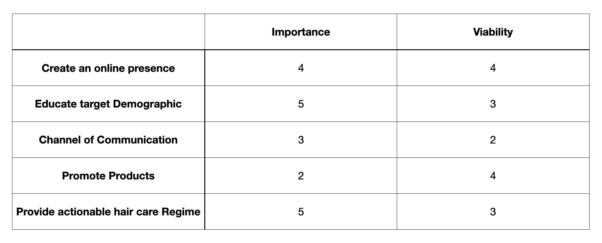
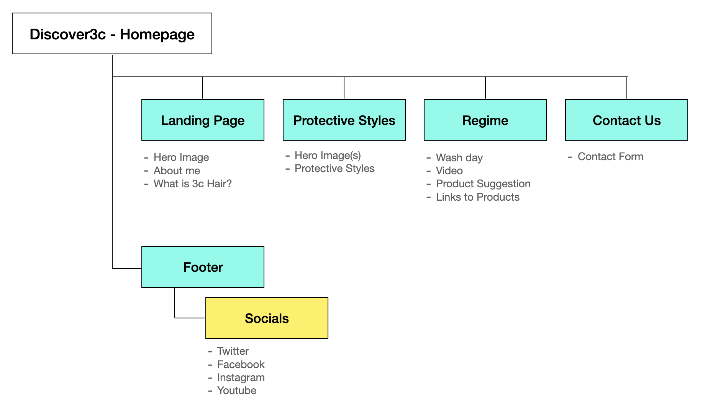

# Discover3c


[View the live project here](https://rebeccatraceyt.github.io/KryanLive/)

## Table of contents
1. [Introduction](#Introduction)
2. [UX](#UX)
    1. [Ideal User Demographic](#Ideal-User-Demographic)
    2. [User Stories](#User-Stories)
    3. [Development Planes](#Development-Planes)
    4. [Design](#Design)
3. [Features](#Features)
    1. [Design Features](#Design-Features) 
    2. [Existing Features](#Existing-Features)
    3. [Features to Implement in the future](#Features-to-Implement-in-the-future)
4. [Issues and Bugs](#Issues-and-Bugs)
5. [Technologies Used](#Technologies-Used)
     1. [Main Languages Used](#Main-Languages-Used)
     2. [Additional Languages Used](#Additional-Languages-Used)
     3. [Frameworks, Libraries & Programs Used](#Frameworks,-Libraries-&-Programs-Used)
6. [Testing](#Testing)
     1. [Testing.md](TESTING.md)
7. [Deployment](#Deployment)
     1. [Deploying on GitHub Pages](#Deploying-on-GitHub-Pages)
     2. [Forking the Repository](#Forking-the-Repository)
     3. [Creating a Clone](#Creating-a-Clone)
8. [Credits](#Credits)
     1. [Content](#Content)
     2. [Media](#Media)
     3. [Code](#Code)
9. [Acknowledgements](#Acknowledgements)
***

## Introduction

This website was designed to help people better understand and manage 3c hair. This is a categorisation of relatively tightly curled hair that can appear in all races but in the UK is more predominant in those with BME backgrounds.

Due to the relatively small percentage of this hair type there is a shortage of information available which this website seeks to address.

This website could also have further commercial applications given there is a large market for hair care products and management regimes.

This is the first of four Milestone Projects that the developer must complete during their Full Stack Web Development Program at The Code Institute. 

The main requirements were to make a responsive and static website with a minimum of three pages using primarily **HTML5** and **CSS3**.

[Back to top ⇧](#Kryan-Live)

## UX 

### Ideal User Demographic
#### The ideal user of this website is:
- Someone with 3c hair
- Friends or parents of those with 3c hair 
- Stylists and hairdressers
- Those with a general interest in diversity and styles

### User Stories
#### Someone with 3c hair:
1. As someone with 3c hair, I want to easily navigate through the website to find the relevant content.
2. As someone with 3c hair, I want to learn the background to this hair.
3. As someone with 3c hair, I want a clear guide to identify my hair type.
4. As someone with 3c hair, I want to be able to view options for my hair.
5. As someone with 3c hair, I want information that enables me to manage my hair effectively, including product suggestions. 

#### Friends or parents of those with 3c hair:
1. As a current fan, I want to navigate to information about upcoming live events in order to securely order tickets.
2. As a current fan, I want to find out about new and upcoming releases to be able to pre-save or listen to the music.
3. As a current fan, I want to easily navigate to the artist's music page on my desired music platform, e.g. Spotify.

### Development Planes

In order to create a comprehensive and informative website, the developer worked closely with the artist to distinguish the required functionality of the site and how it would answer the user stories, as described above.

#### Strategy
Broken into three categories, the website will focus on the following target audiences:
- **Roles:**
     - People currently transitioning to natural hair 
     - People with natural hair (specifically 3c)
     - People wanting to learn more about natural hair

- **Demographic:**
     - 14 - 60 year olds
     - Primarily BME and mixed race (not exclusively)

- **Psychographics:**
     - Personality & Attitudes:
          - Pro natural hair
          - Curious and open minded
     - Values:
          - Hair health conscious 
          - Respects and appreciates differences in ethnicity
     - Lifestyles:
          - Modern
          - Interested in style

The website needs to enable the **user** to:
- Obtain desired information
- Gain knowledge on this particular topic
- Contact website host
- Upcoming live events
- Find them on their preferred social media platform)

The website needs to enable the **host** to:
- Develop an online presence 
- Provide an easily navigable website for users to find relevant information:
- Reach the target demographic 
- Provide channel of communication for specific products and product providers

With these goals in mind, a strategy table was created to determine the trade-off between importance and viability with the following results:



#### Scope
A scope was defined in order to clearly identify what needed to be done in order to align features with the strategy previously defined. This was broken into two categories:
- **Content Requirements**
     - The user will be looking for:
          - Hair care information
          - Product information
          - Supporting imagery/videos
          - Contact details
          - Social Links
- **Functionality Requirements**
     - The user will be able to:
          - Easily navigate through the site in order to find the information they want
          - Be able to find links to external sites in order to:
               - Purchase products
               - Be able to watch supporting content
          - Contact the website host via their chosen channel of communication

#### Structure
The information architecture was organized in a **hierarchial tree structure** in order to ensure that users could navigate through the site with ease and efficiency, with the following results: 



#### Skeleton 
Wireframe mockups were created in a [Figma Workspace](https://www.figma.com/file/pRD2Oi1aSuYxhFacqOmUfT/Kryan-Live?node-id=0%3A1) with providing a positive user experience in mind:

Home Page:


Bio Page:


Live Page:


Press Kit Page:


### Design

#### Colour Scheme
The main colours used throughout the website are Ecru, Brown and Peach with accents of Teal and Orange. 

The chosen colour scheme was to reflect nature and the colours that are typically found in this type of hair.

#### Typography
The pairing of the fonts [Roboto](https://fonts.google.com/specimen/Roboto "Link to Roboto Google Font") and [Oswald](https://fonts.google.com/specimen/Oswald "Link to Oswald Google Font") is used throughout the website with Sans Serif as the fallback font in case of import failure. 

For features that needed to be highlighted, such as the logo text and subheadings, the font [Codystar](https://fonts.google.com/specimen/Codystar "Link to Codystar Google Font") and [Petit Formal Script](http://fots.google.come/specimen/ "Link to Petit Formal Script Google Font") was used, with Sans Serif as the fallback.

#### Imagery
The selected imagery is modern and cohesively aesthetic, reflecting the artist's look and feel. 

The imagery is catching and visually represents the theme of the website.

All imagery provides alternative text to be used in the event that the element cannot be rendered. The template used to provide alt text for background images can be found  [here](http://www.davidmacd.com/blog/alternate-text-for-css-background-images.html "Link to alt text reference on www.davidmacd.com").

[Back to top ⇧](#Kryan-Live)

## Features

### Design Features
Each page of the website features a consistent responsive navigational system:
- The **Header** contains a conventionally placed **logo** in the top left of the page (whereby by clicking this will redirect users back to the home page) and **navigation bar** in the top right of the page.
- The **Footer** contains the appropriate **social media icons**, linking users to the appropriate social media site. On smaller screens the Footer decreases in size relative to the other elements on the page.
- On smaller screens, the navigation bar shrinks in size and goes under the logo.


<dl>
  <dt><a href="index.html" target="_blank" alt="Kryan Home Page">Home Page</a></dt>
  <dd>The Home Page is divided two columns wide on desktops and one column wide on mobile and tablet devices:
     <ul>
          <li><strong>Hero Image</strong> - Occupying 50% of the page width, on the left side, while viewing on a desktop. On mobile and tablet devices, the image becomes stacked at the top of the page, occupying 100% of the page width. The imagery used was specifically chosen as it created a impactful first impression, setting the tone of the website for the user.
          </li>
          <li><strong>Banner Container</strong> - Occupying 50% of the width, on the right side, while viewing on a desktop. On mobile and tablet devices, the container becomes stacked, underneath the <strong>Hero Image</strong>. The purpose of the container is to provide an area in the center to highlight the latest release from the artist. This style was chosen in order to draw the users attention to the information straight away. In this, there is a <strong>call to action</strong> button linking to the external page where users can select their preferred platform to listen to the latest release.
          </li>
     </ul>
  </dd>

  <dt><a href="bio.html" target="_blank" alt="Kryan Bio Page">Bio Page</a></dt>
  <dd>The Bio Page is divided similarly to the Home Page in order to maintain consistency. Just like the Home page, the Bio page is two columns wide on desktops and one column wide on mobile and tablet devices:
     <ul>
          <li><strong>Hero Image</strong> - Occupying 50% of the page width, on the left side, while viewing on a desktop. On mobile and tablet devices, the image becomes stacked at the top of the page, occupying 100% of the page width. The imagery used was specifically chosen to visually represent the tonality of the artist's persona.
          </li>
          <li><strong>Banner Container</strong> - Occupying 50% of the width, on the right side, while viewing on a desktop. On mobile and tablet devices, the container becomes stacked, underneath the <strong>Hero Image</strong>. The container provides the biographic information of the artist. It was styled this way in order to draw the users attention to the biography, avoiding information overload in an already text-based area. The information is presented in an accordion menu.
          </li>
     </ul>
  </dd>

  <dt><a href="live.html" target="_blank" alt="Kryan Live Page">Live Page</a></dt>
  <dd>The Live page structurally similar to the other pages with two clearly divided columns, providing a uniformed and consistent look for aesthetic purposes:
     <ul> 
          <li><strong>Hero Image</strong> - Occupying 50% of the page width, on the left side, while viewing on a desktop. On mobile and tablet devices, the image becomes stacked at the top of the page, occupying 100% of the page width. The image is a secondary feature of this page, but still accurately representing the look and feel of the website.
          </li>
          <li><strong>Banner Container</strong> - Occupying 50% of the width, on the right side, while viewing on a desktop. On mobile and tablet devices, the container becomes stacked, underneath the <strong>Hero Image</strong>. The column contains a <strong>iframe</strong> feature of the event's location, providing users with easy access to directions to the venue. This feature is not available on mobile devices as, in trying to fit the two columns stacked, it would render the text unreadable. There are two <strong>call to action</strong> buttons on the page:
          <ul>
               <li>The venue name acts a button that leads users to the event page on Facebook.
               </li>
               <li> Clicking the tickets button (with hover animation) will lead the user to the ticket purchasing site for the event.
               </li>
          </ul>
     </ul>

  </dd>

  <dt><a href="epk.html" target="_blank" alt="Kryan Press Kit Page">Electronic Press Kit Page</a></dt>
  <dd> On the desktop, the EPK Page has a half page static background <strong>image carousel</strong> that is fixed and unmoving as the user scrolls through the page. The other half of the pages houses the EPK information in one <strong>container</strong>. The information is separated by a <strong>horizontal ruler</strong> in order to emphasis each piece. On a smaller screen, the page becomes stacked, whereby the images are at the top of the page, but not fixed, followed by the information. 
  </dd>
  <dd>There is a <strong>call to action</strong> button on the page:
     <ul>
          <li>Linking to the external article where the quote is sourced from, in this case Indie Buddy</li>
     </ul>
  </dd>
  <dd>There are two <strong>embedded links</strong> that were chosen to showcase the artist's best releases in both audio and video format:
     <ul>
          <li><strong>Spotify</strong> embedding, showcasing the most played music on Kryan's Spotify page</li>
          <li><strong>IGTV</strong> embedding, showcasing his latest music video</li>
     </ul>
  </dd>
  <dd>
     There is a point of contact at the bottom of the Press Kit providing:
     <ul>
          <li>An <strong>mailto</strong> button for users to contact PR representative </li>
          <li>A <strong>contact form</strong>, allowing users to leave a message, by completing the required fields</li>
     </ul>
      
  </dd>
</dl>
 
### Existing Features
- **Header Logo** - Appearing on every page for brand recognition. Clicking the logo will return the users to the home page, as expected.
- **Header Navigation Bar** - Appearing on every page for a consistently easy and intuitive navigable system.
- **Social Icons** - Appearing on every page, the icons are appropriate representations of the Social Media platforms, linking users to Kryan's page on each. On larger screens, the icons appear in the footer. On smaller screens the icons appear in the collapsed toggler function.
- **Call To Action buttons** - Appearing on every page, excluding the Bio Page. Maintaining a consistent and uniform design throughout the page. Clicking the buttons will send users to external sites for various purposes:
     - Music platform selection page
     - Articles featuring Kryan
     - External ticket purchasing site
     - Link to events page
     - Mailto action function for contacting PR representative
- **Spotify Embed** - Snapshot of Kryan's Spotify page, showcasing a select number of tracks users can choose to play.
- **IGTV Embed** - iframe element for a video uploaded to Instagram, showcasing a stripped down version of a latest release. This embed was copied straight from Instagram. The developer did not want to alter this text in order to maintain the integrity of the embedding. The only change made was to override the `min-width` value to `min-width: 70% !important;` in order to fixed a problem with the responsiveness of the embed.
- **Google Maps Embed** - iframe embedding of Google maps, showing the location for the event on the Live Page. The map is omitted from small devices in order to ensure the readability of the page on mobile devices (an issue that the developer struggled with was trying to implement both but still keeping the text at a readable size).
- **Accordion** - An accordion menu on the Bio Page allows user to look through the previous works of the artist. When one accordion is clicked, the others are automatically minimized for UX purposes.
- **Carousel** - A carousel showcasing select images is implemented in the Press Kit page. Using press photos selected by the artist, the carousel highlights their previous events and photo shoots.
- **Contact Form** - A contact form is used in the Press Kit page, in order to provide a point of contact for the user. The form is not validated but there is a `mailto` action above it, providing contact details for the Event Booker of the artist.
- **404 page** - A 404 page providing a clear call to action button to redirect the user to the home page.
- **[Bio Page](bio.html "Kryan Bio Page")** - Providing biographic information for the users to get an understanding of who the artist is, and how they have created their music, presented in an accordion menu.
- **[Live Page](live.html "Kryan Live Page")** - Providing information on upcoming events. On larger screens, an iframe embed of Google Maps is used to provide the location details of the event. There are also call to action buttons for:
     - The venue site, for further information and directions
     - The ticket purchasing platform for pricing and ordering

- **[Electronic Press Kit Page](epk.html "Kryan Press Kit Page")** - Providing a compressed view of the artist with snapshots of relevant information:
     - Media coverage (featured articles)
     - Sample works - audio and video
     - Contact channels for PR representative

### Features to Implement in the future
- **Merchandise Shop**
     - **Feature** - set up an shop where the artist can sell their merchandise directly to fans online.
     - **Reason for not featuring in this release** - JavaScript needed to implement.
 
 - **[LinkFire](https://www.linkfire.com/ "Link to LinkFire page") embedding**
     - **Feature** - smart-link embedding platform for music promotion
     - **Reason for not featuring in this release** - Budget not available for services

[Back to top ⇧](#Kryan-Live)

## Issues and Bugs 
The developer ran into a number of issues during the development of the websites, with the noteworthy ones listed below, along with solutions or ideas to implement in the future.

**Navbar Bug** - A bug was detected early on with the Navigation bar. In implementing a responsive navigation system, Bootstrap was used but there was bug that would not allow the navbar to be recolored to suit the the chosen colour scheme. In researching a cause (and solution) the developer found a question posted on [Stack Overflow](https://stackoverflow.com/questions/46237610/bootstrap-4-navbar-color-wont-change "Link to Stack Overflow solution") with a similar problem. It was from here that the developer was able to copy and edit the code given as a solution on Stack in order to implement a solution to the bug, with celebratory success.

**Home Page Responsiveness Bug** - A bug was detected in creating the HomePage where the mobile-first design approach was responsive but as soon as the breakpoint changed to a larger screen, the page layout would shift, creating inconsistencies in the design. In order to rectify this, the developer utilized a solution posted for a similar problem on [Stack Overflow](https://stackoverflow.com/questions/5703552/how-can-i-center-text-horizontally-and-vertically-inside-a-div-block "Link to Stack Overflow solution"). With this solution, the developer was able to create the desired responsiveness without having to use excessive and unnecessary lines of code.

**Hero Image Issue - Home Page** - A bug was detected when implementing the hero image to be used for the Home Page. The developer used the shorthand background element to implement the image but soon found there was an issue with the responsiveness of the image using this. When coding the background-size using the shorthand method, the image would disappear. The developer used an answer to a similar problem on [Stack Overflow](https://stackoverflow.com/questions/26236486/background-size-cover-not-working "Link to Stack Overflow solution") in order to understand the problem and, in turn, find a solution.

**Social Links Issue** - A bug was detected in the Social Links when trying to implement the Bootstrap display property in order to only show the Social links in the toggler menu on smaller devices. In nesting an unordered list within another unordered list, the `padding-inline-start` of the `ul` user agent stylesheet would be set at a value of `40px`. The problem with this was that it was overriding the `d-inline` class that was called. In order to rectify this, the developer had to override the `padding-inline-start` value, using code sourced from [Stack Overflow](https://stackoverflow.com/questions/54000514/unordered-list-in-css-will-not-center "Link to Stack Overflow solution") with:
```
padding: 0px; 
margin: 0px auto;
```
**Biographic Info Bug (Bio Page)** - A bug was detected on the Bio page whereby when the page was viewed on a smaller screen, the overflow content of the `p` element would be cut off, losing some of the biographic text. In order to solve the problem, the developer found a similar problem on [Stack Overflow](https://stackoverflow.com/questions/52394425/100vh-cuts-off-content-when-window-height-is-small "Link to Stack Overflow solution") where they were able to better understand the viewport limitations and find a solution, which was a simple switch from `height` to `min-height`.

**Google Maps iFrame Issue (Live Page)** - A bug was detected with the iframe element of the Live Page (which was used to implement a Google Maps embed). There was a problem with the responsiveness of the iframe, causing it to extend its width far beyond the page upon resizing. while `overflow: hidden;` would have worked with larger screens, it was proving problematic with smaller screens. The developer found a post from [Digital Inspiration](https://www.labnol.org/internet/embed-responsive-google-maps/28333/ "Link to Digital Inspiration solution") in order to better understand the problem and to successfully implement a solution.

**IGTV Bug (Press Kit Page)** - A bug was detected in the in IGTV embedding code which was affecting the responsiveness of the embed. The `min-width: 326px` value was distorting the video when viewing on a mobile device. Using a post with a similar problem from [WordPress](https://wordpress.org/support/topic/problem-embedding-instagram/ "Link to Digital Inspiration solution") the developer was able to override this with a `!important` value after the set element, allowing it to be responsive across all devices. The developer recognizes that this may not be best practice but, in this case, it was necessary in order to maintain responsiveness.

**IGTV Issue (Press Kit Page)** - In copying the embedding code for the IGTV video, the developer noticed that there were inline styling elements within the code itself. Knowing that this is bad practice, the developer tried to implement the styling rules into their own external style sheet but this proved difficult. Some of the styling copied over easily but they soon ran into issues whereby the embedding stopped working completely. The decision was made to ultimately leave the code as is (not to edit it) in order to maintain the integrity of the embedding.

**Contact Form Issue (Press Kit Page)** - In the initial designs, the developer planned to use a modal to display a success message once the user submitted their details in the contact form (the code for which can be found in earlier versions found in my commit history). However, on testing, it was noted that the success message modal would pop up even when the user had not completed all required fields. In lacking the knowledge to fix this issue with Java Script, the developer opted to use a short message pop-up on button click. 

[Back to top ⇧](#Kryan-Live)

## Technologies Used
### Main Languages Used
- [HTML5](https://en.wikipedia.org/wiki/HTML5 "Link to HTML Wiki")
- [CSS3](https://en.wikipedia.org/wiki/Cascading_Style_Sheets "Link to CSS Wiki")

### Additional Languages Used
- [JavaScript](https://en.wikipedia.org/wiki/JavaScript "Link to JavaScript Wiki")
     - Used to implement a function that allowed the Navbar to change colour when user scrolls through page on mobile device, for UX purposes.

### Frameworks, Libraries & Programs Used
- [Bootstrap](https://getbootstrap.com/docs/4.4/getting-started/introduction/ "Link to Bootstrap page")
     - Bootstrap was used to implement the responsiveness of the site, using bootstrap classes.
- [Google Fonts](https://fonts.google.com/ "Link to Google Fonts")
    - Google fonts was used to import the fonts "Roboto", "Lato" and "Montserrat" into the style.css file. These fonts were used throughout the project.
- [Font Awesome](https://fontawesome.com/ "Link to FontAwesome")
     - Font Awesome was used on all pages throughout the website to import icons (e.g. social media icons) for UX purposes.
- [Git](https://git-scm.com/ "Link to Git homepage")
     - Git was used for version control by utilizing the GitPod terminal to commit to Git and push to GitHub.
- [GitHub](https://github.com/ "Link to GitHub")
     - GitHub was used to store the project after pushing
- [Figma](https://www.figma.com/ "Link to Figma homepage")
     - Figma was used to create the wireframes during the design phase of the project.
- [Am I Responsive?](http://ami.responsivedesign.is/# "Link to Am I Responsive Homepage")
     - Am I Responsive was used in order to see responsive design throughout the process and to generate mockup imagery to be used.

[Back to top ⇧](#Kryan-Live)

## Testing

Testing information can be found in a separate testing [file](TESTING.md "Link to testing file")

## Deployment

This project was developed using [Visual Studio Code Insiders](https://code.visualstudio.com/insiders/ "Link to Visual Studio Code site"), committed to git and pushed to GitHub using the computer terminal.

### Deploying on GitHub Pages
To deploy this page to GitHub Pages from its GitHub repository, the following steps were taken:

1. Log into [GitHub](https://github.com/login "Link to GitHub login page") or [create an account](https://github.com/join "Link to GitHub create account page").
2. Locate the [GitHub Repository](https://github.com/rebeccatraceyt/KryanLive "Link to GitHub Repo").
3. At the top of the repository, select Settings from the menu items.
4. Scroll down the Settings page to the "GitHub Pages" section.
5. Under "Source" click the drop-down menu labelled "None" and select "Master Branch".
6. Upon selection, the page will automatically refresh meaning that the website is now deployed.
7. Scroll back down to the "GitHub Pages" section to retrieve the deployed link.
8. At the time of submitting this Milestone project the Development Branch and Master Branch are identical.

### Forking the Repository
By forking the GitHub Repository we make a copy of the original repository on our GitHub account to view and/or make changes without affecting the original repository by using the following steps...

1. Log into [GitHub](https://github.com/login "Link to GitHub login page") or [create an account](https://github.com/join "Link to GitHub create account page").
2. Locate the [GitHub Repository](https://github.com/rebeccatraceyt/KryanLive "Link to GitHub Repo").
3. At the top of the repository, on the right side of the page, select "Fork"
4. You should now have a copy of the original repository in your GitHub account.

### Creating a Clone
How to run this project locally:
1. Install the [GitPod Browser](https://www.gitpod.io/docs/browser-extension/ "Link to Gitpod Browser extension download") Extension for Chrome.
2. After installation, restart the browser.
3. Log into [GitHub](https://github.com/login "Link to GitHub login page") or [create an account](https://github.com/join "Link to GitHub create account page").
2. Locate the [GitHub Repository](https://github.com/rebeccatraceyt/KryanLive "Link to GitHub Repo").
5. Click the green "GitPod" button in the top right corner of the repository.
This will trigger a new gitPod workspace to be created from the code in github where you can work locally.

How to run this project within a local IDE, such as VSCode:

1. Log into [GitHub](https://github.com/login "Link to GitHub login page") or [create an account](https://github.com/join "Link to GitHub create account page").
2. Locate the [GitHub Repository](https://github.com/rebeccatraceyt/KryanLive "Link to GitHub Repo").
3. Under the repository name, click "Clone or download".
4. In the Clone with HTTPs section, copy the clone URL for the repository.
5. In your local IDE open the terminal.
6. Change the current working directory to the location where you want the cloned directory to be made.
7. Type 'git clone', and then paste the URL you copied in Step 3.
```
git clone https://github.com/USERNAME/REPOSITORY
```
8. Press Enter. Your local clone will be created.

Further reading and troubleshooting on cloning a repository from GitHub [here](https://docs.github.com/en/free-pro-team@latest/github/creating-cloning-and-archiving-repositories/cloning-a-repository "Link to GitHub troubleshooting")

[Back to top ⇧](#Kryan-Live)

## Credits 

### Content
- The text used in the biographic paragraphs were written by the artist, Ryan Kelly.
- The quote used in the Press Kit page is sourced from [Indie Buddie](https://www.indiebuddie.com/kryan-scars-premiere/ "Link to Indie Buddie").

### Media
- All images were sourced from the artist, Ryan Kelly.
- The text used in the 404 error page was sourced from [CopyAndPasteFonts](https://www.copyandpastefont.com/ "Link to Font editor") and edited by the developer.

### Code 
The developer consulted multiple sites in order to better understand the code they were trying to implement. For code that was copied and edited, the developer made sure to reference this with the code. The following sites were used on a more regular basis:
- [Stack Overflow](https://stackoverflow.com/ "Link to Stack Overflow page")
- [W3Schools](https://www.w3schools.com/ "Link to W3Schools page")
- [Bootstrap](https://getbootstrap.com/ "Link to BootStrap page")
- [JSfiddle](https://jsfiddle.net/ "Link to JSfiddle page")

[Back to top ⇧](#Kryan-Live)

## Acknowledgements

- I would like to thank my friends and family for their valued opinions and critic during the process of design and development.
- I would like to thank my mentor, Seun, for her invaluable help and guidance throughout the process.
- Lastly, I would like to extend my deepest gratitude to Ryan for trusting me in designing this site for him.

[Back to top ⇧](#Kryan-Live)

***


