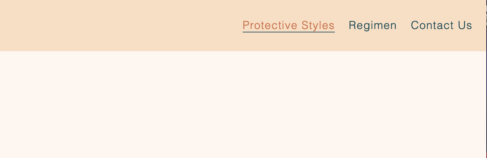
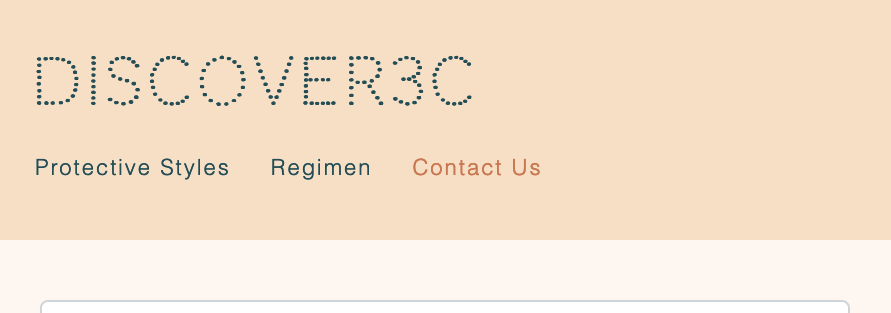
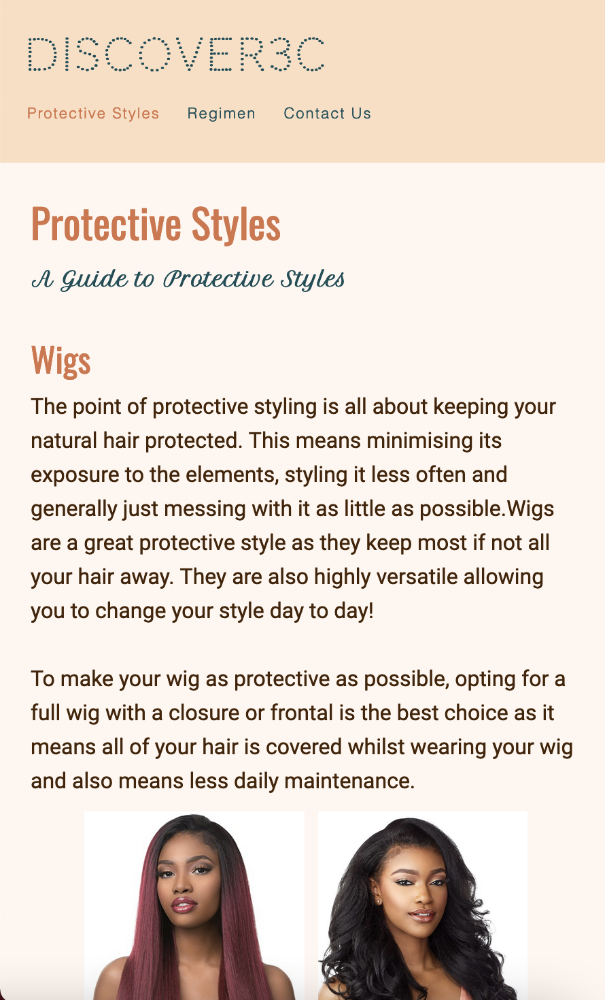
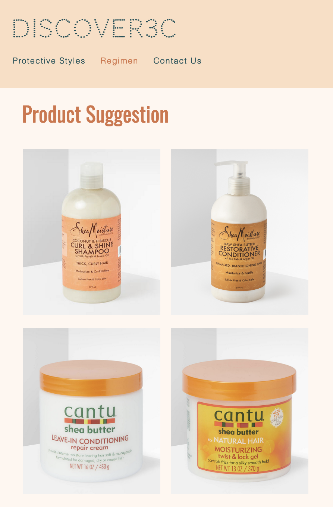
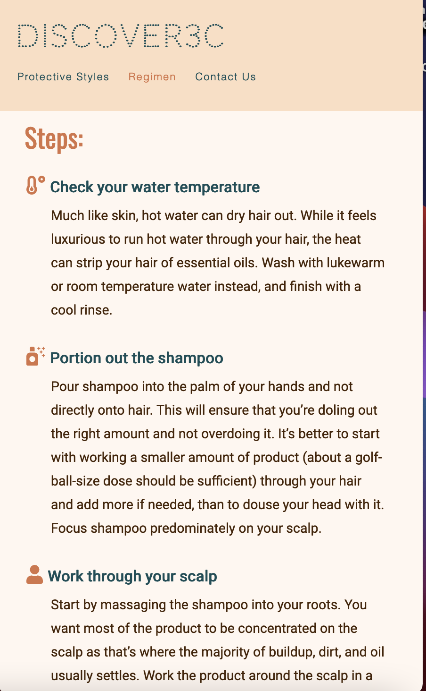
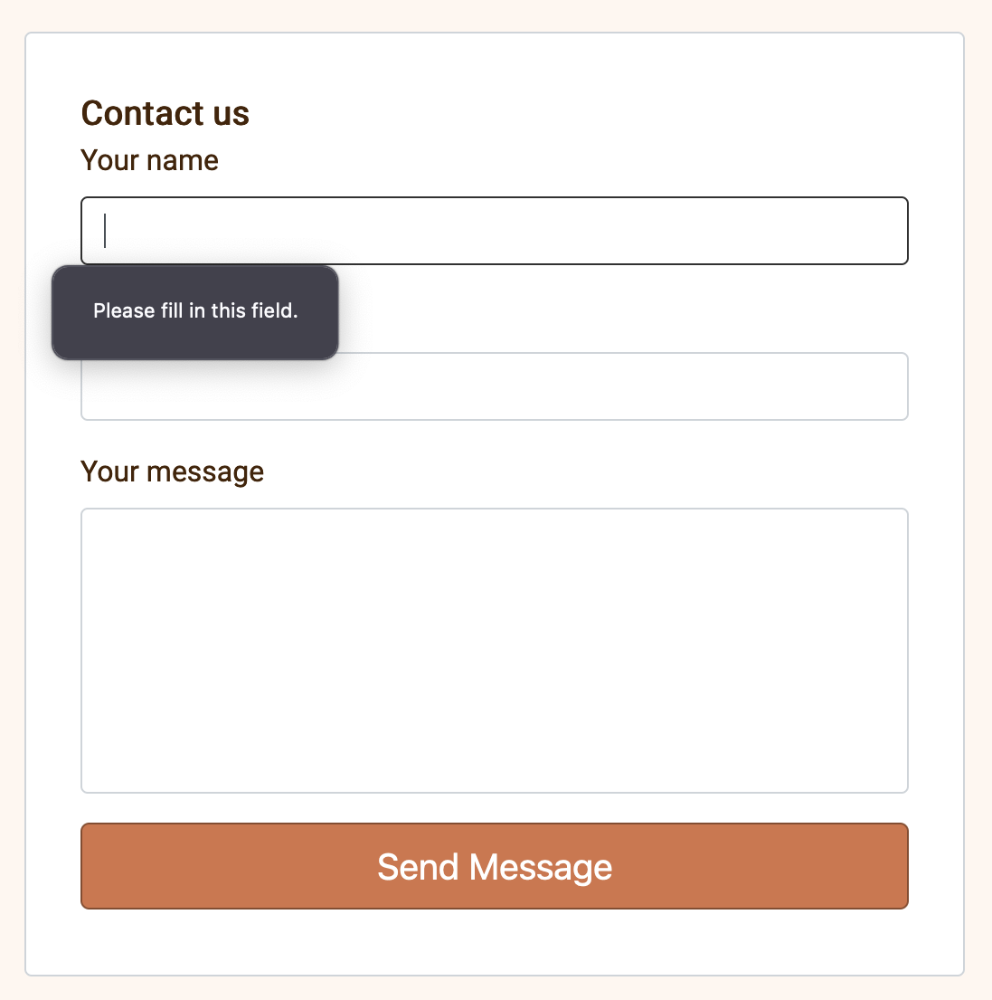
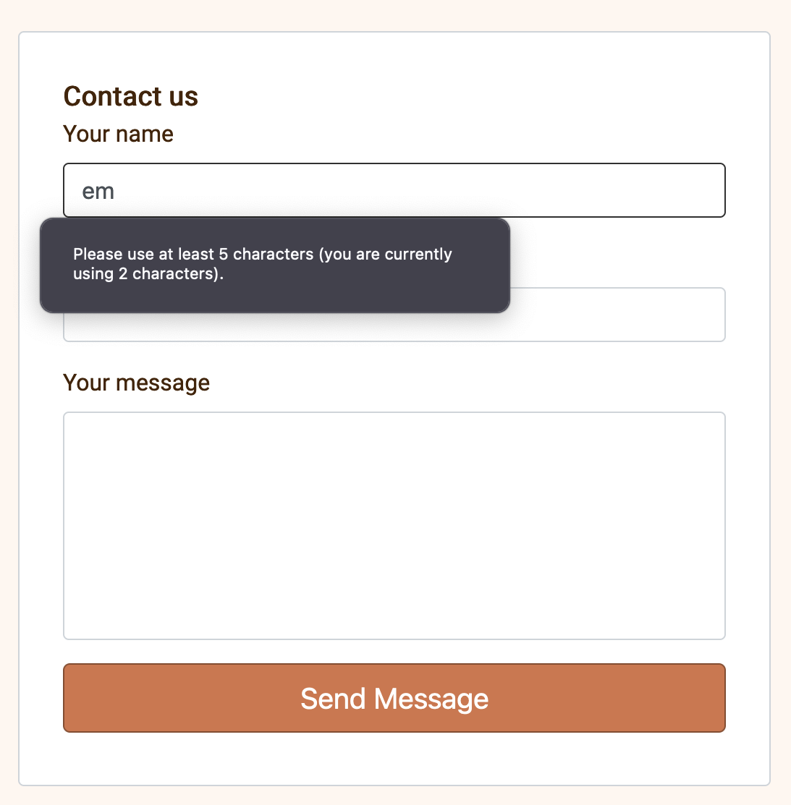
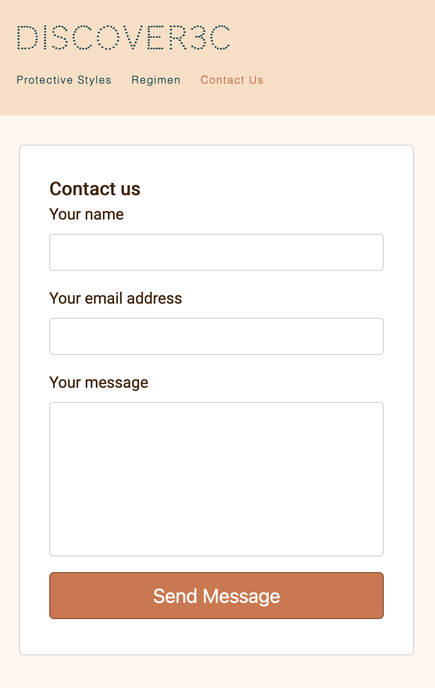
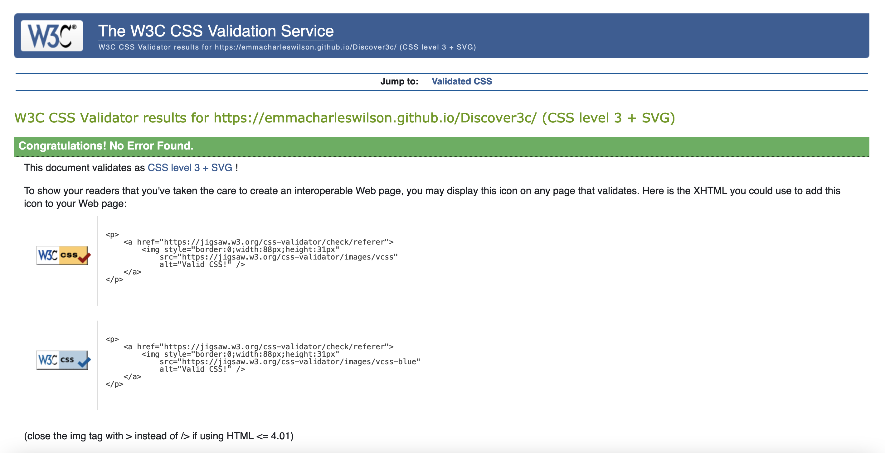
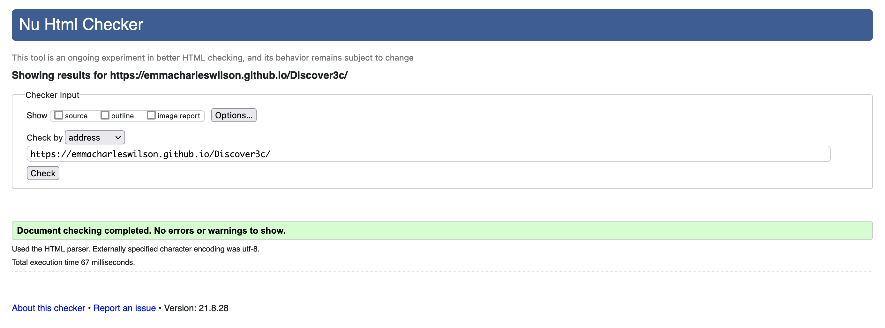

# Discover3c - Testing 

[Main README.md file](/README.md)

[View live project](https://emmacharleswilson.github.io/Discover3c/)

[View website in GitHub Pages](https://github.com/emmacharleswilson/Discover3c)

***
## Table of contents
1. [Testing User Stories](#Testing-User-Stories)
2. [Manual Testing](#Manual-Testing)
3. [Automated Testing](#Automated-Testing) 
     - [Code Validation](#Code-Validation)
     - [Browser Validation](#Browser-Validation)
     - [Lighthouse Auditing](#Lighthouse-Auditing)
4. [User Testing](#User-Testing)

***

## Testing User Stories

#### Someone with 3c hair:
1. As someone with 3c hair I want to easily navigate through the website.

     - The navigation bar is clearly defined and easily navigable for users to find and use.
     - The logo image on the top left of each page leads users back to the home page.
     - The footer menu is easy to use with appropriate icons for easy identification.

2. As someone with 3c hair, I want a clear guide to identify my hair type.

     - The 'Home' page clearly identifies what 3c hair is and looks like. 
     - The 'Home' page also includes imagery to support this content.

3. As someone with 3c hair, I want to be able to view options for my hair.

     - The 'Protective Styles' page includes multiple styles with clear information on each one.
     - The 'Protective Styles' page also includes imagery to support this content. 

4. As someone with 3c hair, I want information that enables me to manage my hair effectively, including product suggestions. 

     - The 'Regiment' page includes a video that explains exactly how to wash your hair. 
     - The 'Regiment' page has a list of steps to support the video in how to wash your hair. 
     - The 'Regiment' page also includes a list of products that the website host personally uses with supporting text.

#### Friends or parents of those with 3c hair:
1. As a friend or parent of someone with 3c hair, I want to easily navigate through the website to find the relevant content. 

     - The menu items are clear and easy to understand allowing the user to easily navigate through the website. 

2. As a friend or parent of someone with 3c hair, I want to learn how to manage 3c hair.

     - The supporting text and videography used on the Regiment page is clear and easy to understand and impliment. 

3. As a friend or parent of someone with 3c hair, I want to learn what products to use on 3c hair. 

     - The Regiment page includes a list of products recommended for 3c hair.
     

[Back to top ⇧](#Discover3c---Testing)

## Manual Testing

### Common Elements Testing
Manual testing was conducted on the following elements that appear on every page:

- Hovering over the Navbar will trigger `hover` effect, confirming the link the users are on
- When on a page that page will highlight orange

     

- Clicking on prefered social media platform will redirect the user to that particular platform 
- On mobile device the menu items will go under the logo

     

### Home Page
Manual testing was conducted on the following elements of the [Home Page](index.html):

- Clicking logo on left of screen will refresh the landing page
- On mobile device the home main image will change

     

- On mobile device, images and text should decrease in size and padding should decrease allowing more space for content 

     

### Protective Styles Page 
Manual testing was conducted on the following elements of the [Protective Styles Page](protective.html):

- Clicking the logo on the top left of the page will return the user to the Home Page 
- On mobile device, images and text should decrease in size and padding should decrease allowing more space for content 

     

### Regimen Page 
Manual testing was conducted on the following elements of the [Regimen Page](regimen.html):

- Clicking on the logo on the top left of the page will return the user to the Home Page 
- Clicking on the video will play the video, and the user will get the option to play the video from YouTube directly 
- On mobile device, product suggestion images should collapse into a block of four, two images on either row for UX purposes

     

- On mobile device, images and text should decrease in size and padding should decrease allowing more space for content

     

### Contact Us Page 
Manual testing was conducted on the following elements of the [Contact Us Page](contact.html):

- Clicking on the logo on the top left of the page will return the user to the Home Page 
- Form will prompt the user to fill out each input field or the form won't submit 

     

- Minimum of 5 charcaters will have to be entered or the form won't submit 

     

- On submitted the form the page will refresh 
- On mobile device, the form will increase in width to fill up the page 

     

The [W3C CSS Validator](https://jigsaw.w3.org/css-validator/) service was used to validate the `CSS` code used.

**Results:**

The [W3C Validator](https://validator.w3.org/) service was used to validate the `HTML` code used. 

**Results:** 
